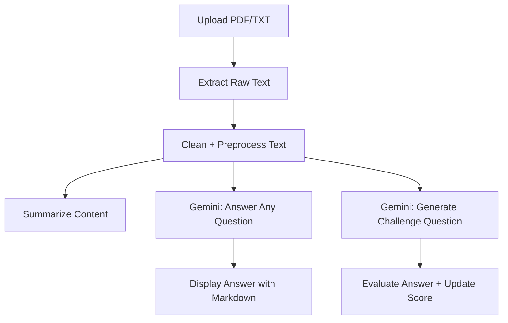

# 📄 Document-Based AI Assistant

An AI-powered assistant that understands documents. Upload a PDF or TXT file, get a clean summary, ask contextual questions, or challenge yourself with logic-based Trivia Questions — powered by Google Gemini 2.0 Flash API and Flask.

---

## 🧠 Why This Project?

Reading large documents is boring and a lengthy process. This AI makes it easier:

- 📑 Understands long documents
- ✨ Summarizes core ideas
- 🤖 Answers your questions contextually
- ⚔️ Tests your understanding with "Challenge Me" mode

No reloads, no noise — just clean UI, smart logic, and fast answers.

---

## 🔧 Setup Instructions

### 1. Clone this repo

```bash
git clone https://github.com/itsudit2003/document-ai-assistant.git
cd document-ai-assistant
```

### 2. Create a virtual environment

```bash
python -m venv venv
source venv/bin/activate    # Windows: venv\Scripts\activate
```

### 3. Install dependencies

```bash
pip install -r requirements.txt
```

### 4. Add your Gemini API Key

Create a `.env` file in the root directory:

```
GEMINI_API_KEY=your_gemini_key_here
```

### 5. Run the app

```bash
python app.py
```

App will be available at:  
➡️ [http://localhost:5000](http://localhost:5000)

---

## 🔍 Features

| Feature                 | Description                                       |
|------------------------|---------------------------------------------------|
| 📄 File Upload         | Upload PDF/TXT documents                         |
| 🧠 Summary Generation   | Generates clear and short summary from text       |
| ❓ Ask Anything        | Gemini-powered QnA from your uploaded document   |
| ⚔️ Challenge Me Mode    | Tests users' knowledge about the PDF context      |
| 💬 Persistent History  | Chat-style UI with saved Q&A threads             |
| 📱 Mobile-friendly     | Chat bubbles & sticky input bar for phones       |

---

## 🧱 Architecture & Reasoning Flow



---

## 💬 Routes Overview

| Route                 | Method | Description                         |
|----------------------|--------|-------------------------------------|
| `/chat`              | POST   | Upload file and generate summary    |
| `/ask`               | POST   | Ask contextual question             |
| `/challenge`         | GET    | Get challenge question              |
| `/submit_challenge`  | POST   | Submit answer to challenge question |

---

## 🗂 Folder Structure

```
.
├── app.py
├── .env
├── requirements.txt
├── templates/
│   ├── chat.html
│   ├── chat_history.html
│   ├── challenge.html
│   ├── login.html
├── static/
│   └── style.css
├── modules/
│   ├── document_reader.py
│   ├── text_cleaner.py
│   ├── summarizer.py
│   ├── chat_engine.py
│   └── challenge_engine.py
├── auth/
│   └── auth.py
├── routes/
│   └── chat.py
    └── auth.py
```

---

## 🧪 Challenge Me Mode (Test your Knowledge)

This mode uses Gemini to:
- Auto-generate a question from your uploaded context  
- Accept your answer  
- Check for correctness & give reason  
- Update score in session

🎯 Great for students who want to *revise notes interactively*.

---

## 🌐 Tech Stack

- 🔥 **Backend**: Flask + Sessions  
- 🧠 **AI Engine**: Google Gemini 2.0 Flash  
- 🧾 **Document Parsing**: PyMuPDF, standard file I/O  
- 🧼 **Cleaning**: Regex, Unicode filters  
- 🎨 **Frontend**: HTML, Bootstrap, CSS (custom chat bubbles)  

---

## 🏁 Future Plans

- ✅ Add Pinecone/FAISS vector store (conversation memory)  
- ✅ Dark mode UI toggle  
- ✅ Admin dashboard to track user scores  
- ✅ Markdown rendering with highlight  

---

## 👤 Author

Made with ❤️ by Udit Sood

---

## 📢 License

MIT License — free to use, modify, and share.
